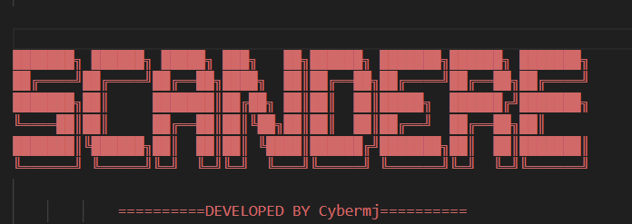

# My CLI Tool

## Overview
This project is a command-line interface (CLI) tool written in Python. It provides a simple and efficient way to perform specific tasks directly from the terminal.


## Features
- Easy to use command-line interface
- Utility functions for processing input and output
- Unit tests to ensure functionality

## Installation
To install the required dependencies, run:

```
pip install -r requirements.txt
```

## Usage
To run the CLI tool, execute the following command in your terminal:

```
python main.py target
```

## Testing
To run the unit tests, use the following command:

```
python -m unittest discover -s tests
```

## Contributing
Contributions are welcome! Please open an issue or submit a pull request for any improvements or bug fixes.

## License
This project is licensed under the MIT License. See the LICENSE file for more details.